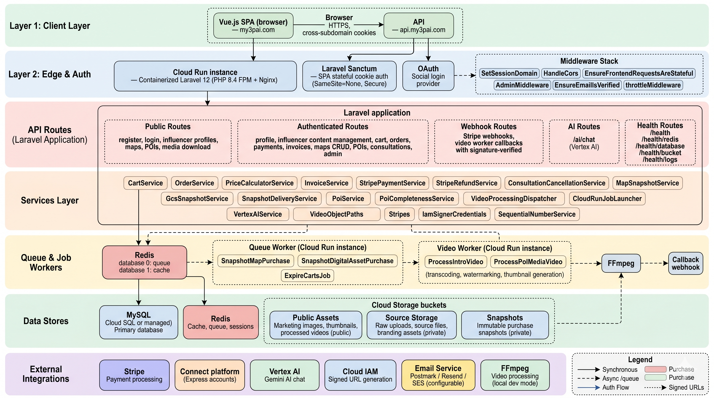

# My3PAI API

<p align="center">
  
  
  
  
  
</p>

---

## 🌍 Overview

**My3PAI** is a next-generation creator commerce platform that empowers travel influencers, map creators, and digital content producers to **build, monetize, and scale** their expertise. This repository contains the complete OpenAPI 3.0.3 specification for the My3PAI REST API — a comprehensive, well-documented blueprint of the platform's entire surface area.

The API powers a multi-sided marketplace connecting **creators** (influencers, map makers, educators) with **consumers** (travelers, learners, adventure seekers) through an ecosystem of:

- 🗺️ **Interactive Travel Maps** with rich Points of Interest (POIs)
- 🎓 **Masterclasses & Courses** — premium educational content
- 🎙️ **Podcasts & Blog Posts** — content publishing and monetization
- 📞 **1-on-1 Consultations** — booking and scheduling with calendar management
- 🎬 **Digital Media Marketplace** — stock footage, presets, templates, and more
- 💳 **Full Commerce Stack** — cart, orders, payments, invoicing, and payouts

---

<p align="center">
  
</p>

---

## ✨ Why My3PAI?

| Problem | My3PAI Solution |
|---------|----------------|
| Travel creators lack monetization tools | Multi-revenue engine: maps, courses, consultations, media sales |
| Fragmented creator tooling | Unified platform: content management, e-commerce, scheduling |
| No standardized travel data | Rich POI schema with filters, media, pricing, and versioning |
| Complex creator payouts | Stripe Connect integration with automated platform fees |
| Limited audience engagement | Blog, podcast, social posts, contact forms — all in one place |

---

## 🏗️ Architecture

```
┌─────────────────────────────────────────────────────────────┐
│                        My3PAI API                           │
├─────────────────────────────────────────────────────────────┤
│  🔐 Authentication Layer  (Laravel Sanctum Token Auth)      │
├─────────────────────────────────────────────────────────────┤
│  📦 Core Domains                                            │
│  ┌──────────┐ ┌──────────┐ ┌──────────┐ ┌──────────────┐  │
│  │  Maps &  │ │ Content  │ │ Creator  │ │  Commerce    │  │
│  │   POIs   │ │  (Blog,  │ │ Services │ │  (Cart,      │  │
│  │          │ │ Podcast, │ │ (Consul- │ │  Orders,     │  │
│  │          │ │ Master-  │ │ tations, │ │  Payments,   │  │
│  │          │ │ classes) │ │ Payouts) │ │  Invoices)   │  │
│  └──────────┘ └──────────┘ └──────────┘ └──────────────┘  │
├─────────────────────────────────────────────────────────────┤
│  💳 Payment Processing  (Stripe Connect)                    │
│  🤖 AI Services  (Google Vertex AI)                        │
│  📊 Admin & Analytics                                       │
└─────────────────────────────────────────────────────────────┘
```

---

## 🚀 Core Capabilities

### 🗺️ Maps & Points of Interest (POIs)

The heart of My3PAI — a sophisticated geographic content system:

- **Rich POI Data Model** — Each POI includes basic info, categories, difficulty levels, pricing, regions, amenities, tips, media, and experiential descriptions
- **Completeness Scoring** — Automated 0-100 scoring with publishability checks
- **Optimistic Locking** — Draft version control prevents concurrent edit conflicts
- **Visibility Controls** — Public/private toggles, featured POIs for map previews
- **Batch Operations** — Bulk visibility toggling and management
- **Advanced Filtering** — Multi-dimensional filters: activity, terrain, audience, accessibility, amenities, tags, countries, difficulty, cost type
- **Media Management** — Images, audio guides, PDF attachments with reordering
- **Unsplash Integration** — Fetch stock images directly during POI creation

### 👤 Creator Ecosystem

A full-stack creator management system:

- **Rich Profiles** — Bio, tagline, location, theme customization, intro video
- **Social Presence** — Manage social links, social posts with reordering
- **Skills & Certifications** — Structured expertise representation
- **Languages** — Multi-language support with ordering
- **External Links** — Portfolio and affiliate link management
- **Creator Tools Visibility** — Granular control over which tools appear on public profiles
- **Contact Management** — Contact form with read/unread tracking and statistics
- **Earnings & Payouts** — Real-time earnings summaries, payout history, Stripe Connect dashboard

### 📚 Content Monetization

| Content Type | Features | Monetization |
|-------------|----------|-------------|
| **Blog Posts** | Rich content, cover images, SEO-friendly slugs | Public / Gated |
| **Podcast Episodes** | Audio uploads, cover art, settings management | Free / Premium |
| **Masterclasses** | Full course content, purchase gating, premium locking | One-time purchase |
| **Consultations** | Calendar availability, time slots, booking, cancellation policies | Per-session pricing |

### 🛒 Commerce Engine

A complete e-commerce infrastructure:

- **Shopping Cart** — Full CRUD with guest session support (X-Session-ID)
- **Guest-to-User Cart Merging** — Seamless conversion on login
- **Orders** — Full lifecycle: pending → processing → completed → cancelled → refunded
- **Digital Downloads** — Secure download links for purchased products
- **Invoicing** — Professional invoice generation with send/download, paid/received views
- **Payment Processing** — Stripe Payment Intents with confirmation flow
- **Platform Fees** — Automated fee calculation with influencer payout amounts

### 🎬 Digital Media Marketplace

- **Asset Types** — Video, Photo, Preset, Audio, Template, Other
- **Purchase Flow** — Individual asset purchases with download management
- **My Purchases** — Centralized library of all purchased digital goods

### 🤖 AI Integration

- **AI Chat** — Google Vertex AI-powered conversational interface
- **Translation** — AI-powered English translation endpoint

### 🛡️ Admin Platform

- **User Management** — CRUD, verification, password management
- **Platform Analytics** — Earnings summaries, activity logs, platform-wide stats

---

## 📋 API Overview

| Category | Endpoints | Description |
|----------|-----------|-------------|
| **Authentication** | `POST /register`, `POST /login`, `POST /logout`, `POST /forgot-password`, `POST /reset-password` | Full auth lifecycle |
| **Profile** | `GET/PUT /profile`, avatar/cover upload, preferences, account management, password change | User self-service |
| **Maps** | CRUD, thumbnail, URL parsing, purchase access | Map lifecycle |
| **POIs** | CRUD with drafts, media, audio, PDF, batch operations, Unsplash integration, filter metadata | Rich geographic content |
| **Influencers** | Public profiles, blog, podcast, masterclasses, consultations, maps, media assets, social posts | Public creator discovery |
| **Creator Tools** | Socials, posts, languages, skills, certifications, external links, blog, podcast, masterclasses, consultations, media assets, payouts, earnings | Creator dashboard |
| **Consultations** | Booking, availability, time slots, calendar, cancellation policies, payment sessions | Scheduling engine |
| **Commerce** | Cart (with guest support), orders, payments, invoices, digital downloads | Full commerce stack |
| **Media Assets** | Marketplace CRUD, purchases, downloads | Digital goods marketplace |
| **Stripe Connect** | Onboarding, status, dashboard link, account management | Payment infrastructure |
| **Admin** | Users, stats, activity, platform earnings | Platform administration |
| **AI** | Chat, translation | AI-powered features |
| **Webhooks** | Stripe events, video worker callbacks | External integrations |

### 🤝 B2B Partner Integration

My3PAI offers a comprehensive set of API endpoints designed for **strategic B2B partners** — travel agencies, tourism boards, content distributors, affiliate networks, enterprise resellers, and SaaS platforms looking to integrate creator commerce into their ecosystem.

#### Partner Onboarding & Payment Infrastructure

| Endpoint | Method | Description |
|----------|--------|-------------|
| `POST /stripe/connect/onboard` | `POST` | Initiate Stripe Connect Express onboarding — returns a hosted onboarding URL for partners to link their payment accounts |
| `GET /stripe/connect/status` | `GET` | Retrieve Stripe account status: connection state, charges enabled, payouts enabled, outstanding requirements |
| `GET /stripe/connect/dashboard` | `GET` | Generate a Stripe-hosted dashboard link for partners to manage payouts, balances, and account details |
| `POST /stripe/connect` | `POST` | Update or manage the connected Stripe account configuration |
| `POST /webhooks/stripe` | `POST` | Receive real-time Stripe event notifications (account updates, payout lifecycle, application deauthorization) |

#### Partner Payouts & Financial Reconciliation

| Endpoint | Method | Description |
|----------|--------|-------------|
| `GET /influencer/earnings/summary` | `GET` | Aggregated earnings with period filtering (all_time, this_month, last_month, this_year) — all amounts in USD |
| `GET /influencer/payouts` | `GET` | Paginated payout history with status filtering (pending, processing, paid, failed) |
| `GET /influencer/payouts/{id}` | `GET` | Detailed view of a specific payout transaction |
| `GET /invoices/summary` | `GET` | Invoice summary statistics with date range filtering — total paid, total received, status breakdown |
| `GET /invoices` | `GET` | Full invoice listing with status and type filters (paid/received), date range, and pagination |
| `GET /invoices/{id}` | `GET` | Single invoice detail with line items and payment information |
| `GET /invoices/{id}/download` | `GET` | Download invoice as PDF for accounting and record-keeping |
| `POST /invoices/{id}/send` | `POST` | Send invoice via email to the customer |

#### Platform Analytics (Admin)

| Endpoint | Method | Description |
|----------|--------|-------------|
| `GET /admin/stats` | `GET` | Platform-wide dashboard statistics: total users, verified users, new registrations, admin counts |
| `GET /admin/platform/earnings` | `GET` | Platform earnings with filtering by influencer, date range, and status (collected, reversed, pending) |
| `GET /admin/platform/earnings/summary` | `GET` | Aggregated platform earnings summary for reporting |
| `GET /admin/activity` | `GET` | Platform activity log for audit and compliance |
| `GET /admin/users` | `GET` | User management with search, filtering, and pagination |
| `GET /admin/users/{id}` | `GET` | Detailed user profile for account management |
| `POST /admin/users/{id}/verify` | `POST` | Verify user accounts — essential for partner-managed creator verification |

#### Commerce & Order Management

| Endpoint | Method | Description |
|----------|--------|-------------|
| `GET /orders` | `GET` | List orders with status and date filtering |
| `GET /orders/sold` | `GET` | Orders sold by the partner/creator |
| `GET /orders/purchased` | `GET` | Orders purchased by customers |
| `GET /orders/{id}` | `GET` | Detailed order view with items, payment, and status |
| `POST /orders/{id}/refund` | `POST` | Process refunds through Stripe |
| `GET /orders/{id}/download` | `GET` | Download order-related digital assets |

#### AI-Powered Partner Tools

| Endpoint | Method | Description |
|----------|--------|-------------|
| `POST /ai/chat` | `POST` | Google Vertex AI Gemini-powered chat — enables partners to build AI travel assistants, content generators, and smart recommendation features |
| `POST /ai/translate-to-english` | `POST` | AI-powered translation to English — useful for partners operating in multilingual markets |

#### Integration Scenarios

**Travel Agency Partnership**
```
Agency Platform
    ├── GET /influencers → Discover creators by location and expertise
    ├── GET /influencers/{username}/maps → Browse available travel maps
    ├── POST /stripe/connect/onboard → Link payment accounts
    ├── GET /influencer/earnings/summary → Track revenue share
    └── POST /ai/chat → Build AI trip planning features
```

**Enterprise Content Distribution**
```
Distribution Platform
    ├── GET /influencers/{username}/masterclasses → Access premium courses
    ├── GET /influencers/{username}/podcast → Syndicate podcast content
    ├── GET /influencers/{username}/media-assets → License digital media
    ├── GET /orders/sold → Track content sales
    └── GET /invoices/summary → Financial reconciliation
```

**Tourism Board Integration**
```
Tourism Board
    ├── GET /maps/{map} → Access curated destination maps
    ├── GET /pois/filters/metadata → Explore POI categories and filters
    ├── GET /influencers/{username}/blog → Curate destination blog content
    ├── POST /influencer/contact → Direct messaging with creators
    └── GET /admin/platform/earnings → Track regional economic impact
```

---

### 🔐 Authentication

The API uses **Laravel Sanctum** token-based authentication:

```http
Authorization: Bearer <your-token>
```

Guest users can access cart endpoints via session-based identification:

```http
X-Session-ID: <your-session-id>
```

### ⚡ Rate Limiting

| Endpoint Group | Limit |
|---------------|-------|
| Authentication | 5 req/min per IP |
| Public Maps | 60 req/min per IP |
| Rate Limit Exceeded | HTTP 429 |

---

## 📁 Repository Structure

```
openapi/
├── openapi.yaml                    # Root OpenAPI specification
├── components/
│   └── schemas/                    # Reusable data models (90+ schemas)
│       ├── User.yaml               # User model with preferences
│       ├── PoiResource.yaml        # Full POI resource with completeness scoring
│       ├── MapResource.yaml        # Map model with pricing and access control
│       ├── InfluencerProfile.yaml  # Rich creator profile
│       ├── Consultation.yaml       # Consultation with working hours
│       ├── MasterclassFull.yaml    # Premium course content
│       ├── Invoice.yaml            # Full invoicing with platform fees
│       ├── Order.yaml              # Order lifecycle management
│       ├── MediaAsset.yaml         # Digital media marketplace
│       ├── Cart.yaml               # Shopping cart
│       └── ...                     # 80+ additional schemas
└── paths/                          # Path definitions (150+ endpoints)
    ├── health.yaml
    ├── register.yaml
    ├── login.yaml
    ├── maps.yaml
    ├── influencers.yaml
    ├── cart.yaml
    ├── orders.yaml
    ├── invoices.yaml
    ├── admin_stats.yaml
    ├── ai_chat.yaml
    └── ...                         # 140+ additional path files
```

---

## 🛠️ Getting Started

### Prerequisites

- An API client (Postman, Insomnia, cURL, or any HTTP client)
- A My3PAI account (for authenticated endpoints)

### Base URLs

| Environment | URL |
|-------------|-----|
| **Local Development** | `http://localhost:8000/api` |
| **Production** | `https://api.my3pai.com/api` |

### Quick Start

```bash
# Register a new account
curl -X POST https://api.my3pai.com/api/register \
  -H "Content-Type: application/json" \
  -d '{"name": "Travel Creator", "email": "creator@example.com", "password": "securepass123", "password_confirmation": "securepass123"}'

# Login to get your token
curl -X POST https://api.my3pai.com/api/login \
  -H "Content-Type: application/json" \
  -d '{"email": "creator@example.com", "password": "securepass123"}'

# Use your token for authenticated requests
curl https://api.my3pai.com/api/me \
  -H "Authorization: Bearer <your-token>"
```

### API Client Setup

Import the OpenAPI specification into your preferred API client:

- **Postman**: File → Import → Select `openapi.yaml`
- **Insomnia**: Create → Import → Select `openapi.yaml`
- **Swagger UI**: Point to the raw `openapi.yaml` URL

---

## 💼 Business Model & Monetization

My3PAI generates revenue through multiple streams:

| Revenue Stream | Description |
|---------------|-------------|
| **Platform Fees** | Percentage fee on every transaction (orders, consultations, media sales) |
| **Premium Map Sales** | Commission on paid map purchases |
| **Digital Media Marketplace** | Transaction fees on preset, template, and asset sales |
| **Consultation Bookings** | Service fee on booked consultations |
| **Masterclass Sales** | Revenue share on premium course content |
| **Creator Subscriptions** *(future)* | Tiered creator plans with enhanced features |

### Platform Economics

```
Customer Payment ($100)
    ├── Platform Fee (variable %)
    ├── Payment Processing (Stripe fee)
    └── Creator Payout (remainder)
```

---

## 🔒 Security & Compliance

- **Token-based Authentication** — Laravel Sanctum with secure token management
- **Stripe Connect** — PCI-compliant payment processing, no sensitive card data stored
- **Rate Limiting** — Protection against abuse and DDoS
- **Input Validation** — Comprehensive schema validation on all endpoints
- **Optimistic Locking** — Prevents data corruption from concurrent edits
- **Environment Separation** — Distinct local and production configurations

---

## 🤝 Contributing

We welcome contributions from the community! Whether you're a developer, travel creator, or API enthusiast, here's how you can help:

1. **Fork** the repository
2. **Create** a feature branch (`git checkout -b feature/amazing-feature`)
3. **Commit** your changes (`git commit -m 'Add amazing feature'`)
4. **Push** to the branch (`git push origin feature/amazing-feature`)
5. **Open** a Pull Request

### Development Guidelines

- Follow OpenAPI 3.0.3 specification standards
- Maintain backward compatibility for existing endpoints
- Add comprehensive schema definitions for new models
- Include meaningful descriptions and examples
- Keep path files modular and focused

---

## 📄 License

This project is licensed under a **Proprietary License** — see the [LICENSE](LICENSE) file for details.

---

## 📬 Contact & Support

| Channel | Details |
|---------|---------|
| **API Support** | [api-support@my3pai.com](mailto:api-support@my3pai.com) |
| **Website** | [https://my3pai.com](https://my3pai.com) |
| **GitHub Issues** | [Report a bug](https://github.com/kavehs87/my3pai-api-docs/issues) |

---

<p align="center">
  <strong>Built for creators. Powered by technology. Ready for the world.</strong>
  <br><br>
  <sub>© 2025 My3PAI. All rights reserved.</sub>
</p>
